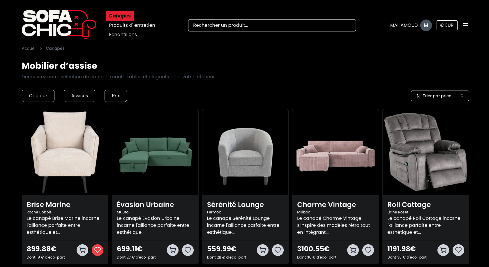

<div align="center">


# 🛋️ SOFACHIC  
### **Le confort rencontre l’élégance.**

Application e-commerce moderne spécialisée dans le mobilier d’assise.  

✅ Catalogue dynamique de canapés  
✅ Filtres intelligents & recherche optimisée  
✅ Panier persistant  
✅ Authentification sécurisée  
✅ Architecture full-stack moderne & scalable  

</div>

---

## 🏗️ Architecture



---

## 🎯 Objectif

Créer une expérience e-commerce premium permettant aux visiteurs de :

- Explorer une sélection raffinée de canapés  
- Filtrer dynamiquement par couleur, assise, prix  
- Ajouter des produits au panier avec persistance  
- Créer un compte et se connecter en toute sécurité  
- Naviguer dans une interface rapide, moderne et responsive  

> 💡 Le design n’est pas seulement esthétique. Il est pensé pour convertir et rassurer.

---

## ✨ Fonctionnalités principales

### 🛋️ Catalogue & navigation
- Affichage dynamique des produits  
- Pages produit détaillées  
- Tri par prix  
- Recherche instantanée  

### 🎛️ Filtres dynamiques
- Filtre par couleur  
- Filtre par nombre d’assises  
- Tri dynamique  
- Synchronisation des filtres dans l’URL (Nuqs)  
- State management global avec Zustand  

### 🔐 Authentification
- Authentification avec **NextAuth**  
- Sessions sécurisées (JWT / Database strategy)  
- Protection des routes sensibles  
- Intégration avec Prisma  
- Pages personnalisées (login / register)  

### 🛒 Panier & favoris
- Ajout / suppression d’articles  
- Modification des quantités  
- Persistance via Redis (Upstash)  
- Optimisation du state côté client  

### ⚡ Performance & UX
- Images optimisées via Supabase Storage (CDN intégré)  
- UI moderne avec ShadCN  
- TailwindCSS pour un design scalable  
- Validation des données avec Zod  
- Responsive mobile / desktop  

---

## 🚀 Stack technique

| Technologie | Rôle |
|-------------|------|
| Next.js (App Router) | Front-end + API routes |
| React | UI Components |
| TailwindCSS | Styling |
| ShadCN UI | Composants accessibles |
| Zustand | State management |
| Nuqs | Synchronisation URL |
| Zod | Validation |
| NextAuth | Authentification |
| Prisma | ORM |
| Supabase (PostgreSQL) | Base de données |
| Supabase Storage | Stockage images + CDN |
| Redis (Upstash) | Cache & panier persistant |
| Vercel | Déploiement |
| Figma | Design UI/UX |

---

## 🧩 Architecture technique

### 1️⃣ Frontend
- Next.js App Router  
- Server & Client Components  
- State global avec Zustand  
- Gestion des filtres synchronisés via URL  
- Gestion de session via NextAuth  

### 2️⃣ Backend
- API Routes Next.js  
- Authentification avec NextAuth  
- Validation des requêtes avec Zod  
- Prisma pour l’accès base de données  
- PostgreSQL via Supabase  

### 3️⃣ Stockage & CDN
- Images stockées sur Supabase Storage  
- Distribution via CDN intégré  

### 4️⃣ Cache & optimisation
- Redis (Upstash) pour panier et performance  
- Optimisation edge via Vercel  

---

## ⚙️ Installation locale

```bash
# Clone le projet
git clone https://github.com/ton-username/sofachic.git

# Installer les dépendances
npm install

# Lancer en développement
npm run dev
